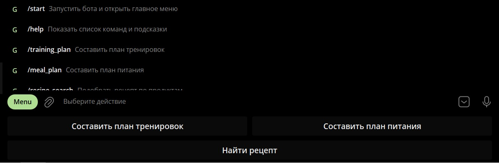
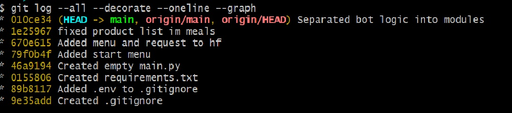

# Fitness Helper Bot

Telegram-бот для помощи пользователю в вопросах тренировок, питания и подбора блюд по имеющимся продуктам.  
Бот предоставляет удобное главное меню, с помощью которого можно:

- составить план тренировок;
- составить план питания;
- подобрать блюда по списку продуктов.

---

## Скриншот главного меню

> В этот раздел необходимо добавить скриншот интерфейса бота с демонстрацией главного меню.

---

## Описание проекта

Проект представляет собой Telegram-бота, разработанного на Python с использованием библиотеки **Aiogram**.  
Бот реализует интерактивное меню и позволяет пользователю получать персонализированные ответы на основе ИИ-модели и внешнего API рецептов.

Основные возможности:

- генерация плана тренировок на 7 дней;
- генерация плана питания на 7 дней;
- подбор возможных блюд по введённым ингредиентам;
- анализ списка продуктов пользователя с попыткой предложить первое, второе и десерт.

---

## Использованный API

### TheMealDB API

В проекте используется **TheMealDB API**.

**Описание API:**  
TheMealDB — это открытый API с базой рецептов, который позволяет:

- искать блюда по ингредиенту;
- получать подробную информацию о рецепте;
- использовать категории блюд и их состав.

**Как используется в проекте:**  
API применяется для подбора блюд по списку продуктов, введённых пользователем.  
Сначала бот ищет блюда по каждому ингредиенту, затем собирает найденные варианты, анализирует совпадения по составу и предлагает наиболее подходящие блюда.

---

## Базовая модель ИИ

В качестве базовой ИИ-модели в проекте используется модель через **Hugging Face Router**.
**Название модели** 'openai/gpt-oss-20b'
Ее функция - отвечать на вопросы польщователя

---

## Использованная модель трансформера

### `katanemo/Arch-Router-1.5B:hf-inference`

**Название модели:** `katanemo/Arch-Router-1.5B:hf-inference`

**Описание задачи модели:**  
Данная трансформерная модель используется для **генерации текстовых ответов**.  
В рамках проекта она решает следующие задачи:

- генерация плана тренировок;
- генерация плана питания;
- формирование текстового ответа на русском языке по списку продуктов;
- подбор вариантов блюд в понятной для пользователя форме.

Иными словами, модель используется для задачи **генерации естественного языка (text generation / answer generation)**.

---

## Используемые технологии

- **Python**
- **Aiogram**
- **OpenAI-compatible client**
- **Hugging Face Router**
- **TheMealDB API**
- **HTTPX**
- **python-dotenv**

---

## Система контроля версий

В проекте используется система контроля версий **Git**.

Также проект размещён в удалённом репозитории **GitHub**, что подтверждает использование удалённого хранилища для:

- сохранения истории изменений;
- резервного хранения исходного кода;
- совместной работы и публикации проекта.

---

## Структура функциональности бота

### 1. План тренировок
Пользователь выбирает:
- цель;
- уровень подготовки;
- количество тренировок в неделю;
- тип инвентаря.

После этого бот генерирует персональный план тренировок на 7 дней.

### 2. План питания
Пользователь выбирает:
- цель питания;
- количество тренировок;
- ограничения в питании.

После этого бот генерирует план питания на 7 дней.

### 3. Подбор блюд по ингредиентам
Пользователь вводит продукты через запятую.  
Бот анализирует весь список ингредиентов, ищет возможные блюда через API рецептов и формирует ответ с вариантами того, что можно приготовить.

---

## Работа с системой контроля вресий (Git)

